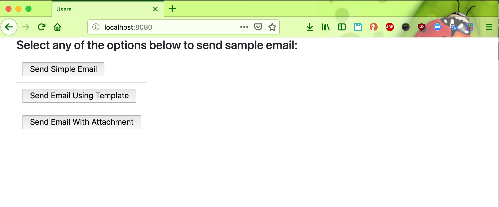
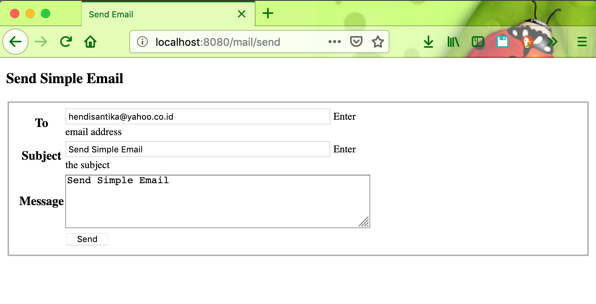
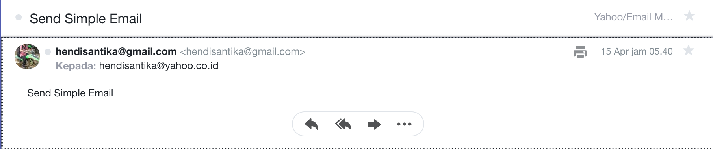
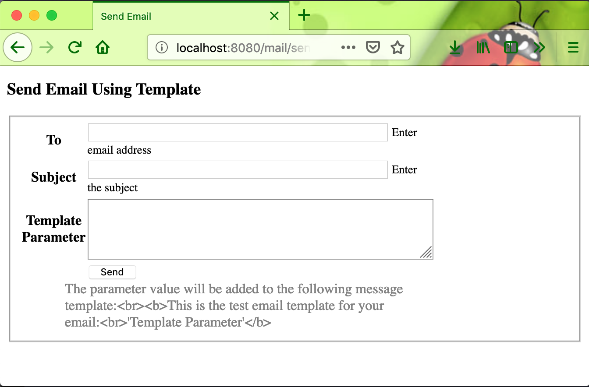
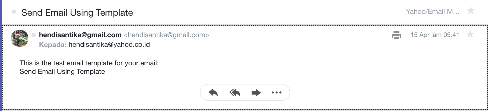
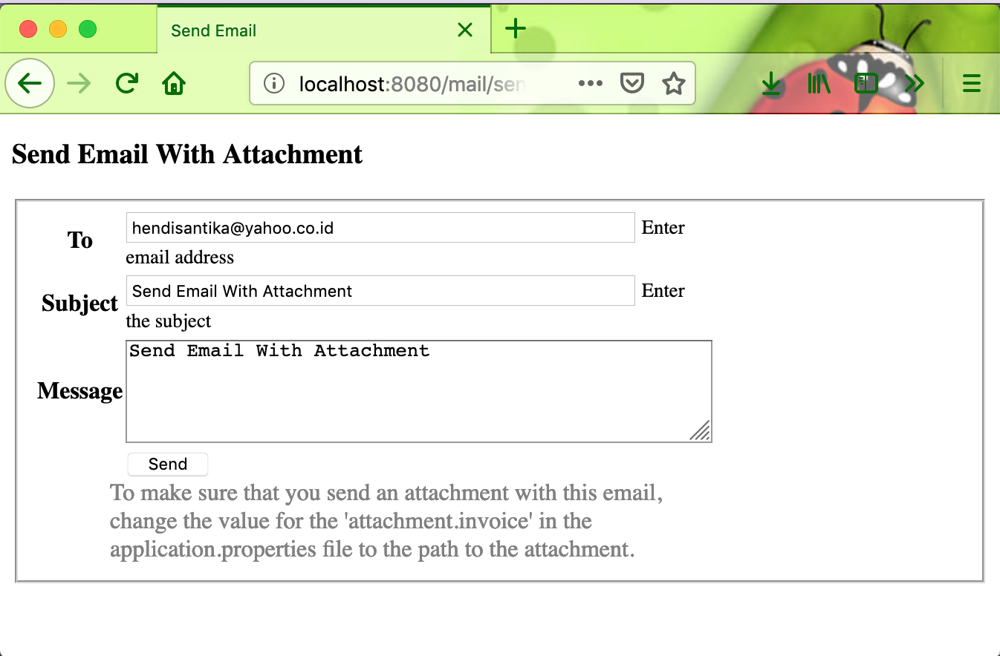
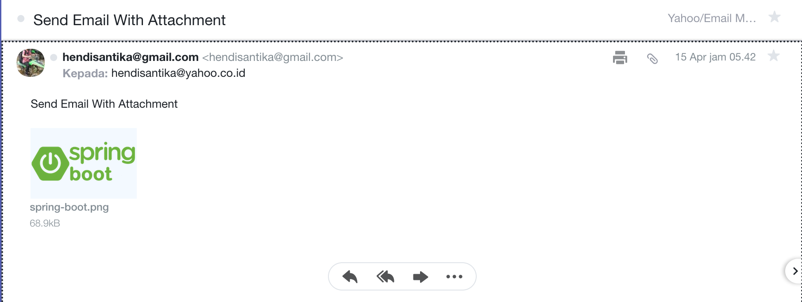

# Spring MVC Email

Example Spring MVC project to send email from web form.

## Installing and Running

* Clone the project repository --> `https://github.com/hendisantika/spring-mvc-email.git`
* Go to the folder --> `cd spring-mvc-email`
* Change email & password with your email address in `application.properties` file.
* If you want to test with attachment, add path to file in `application.properties` file.
* Just run the Spring Boot application --> `mvn clean spring-boot:run`.

Type http://localhost:8080 in your browser to open the application.

## Sending test emails

Follow UI links to send simple email, email using template or email with attachment.

## Screen shot

**Home Page**

**Send Simple Email**

**Send Email Using Template**

**Send Email With Attachment
**

